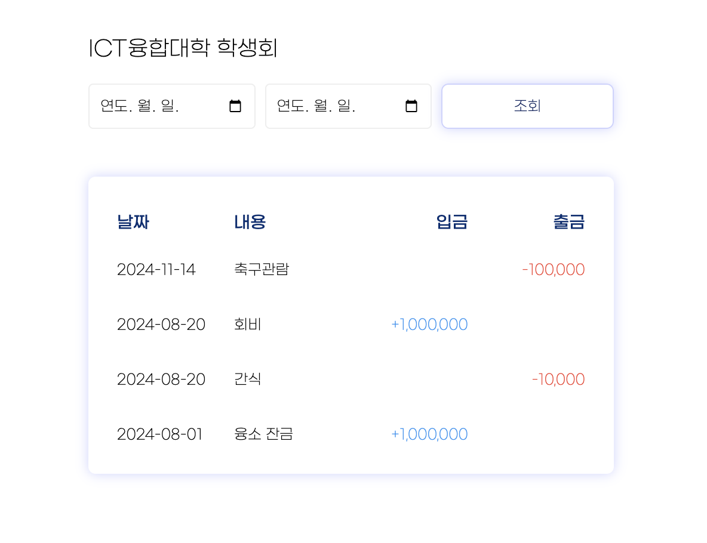
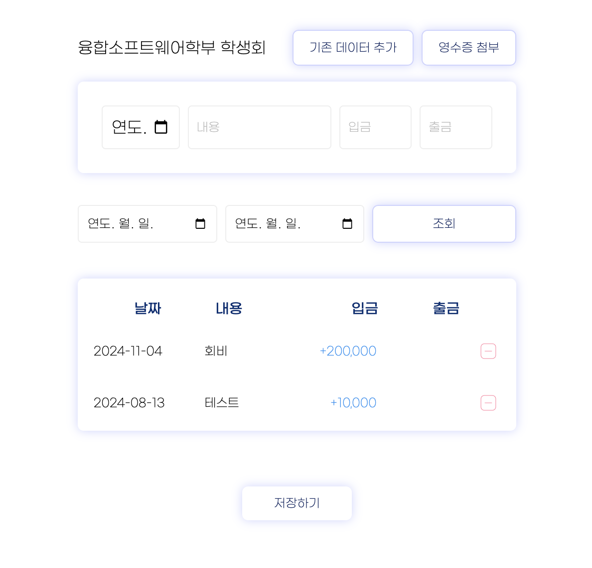
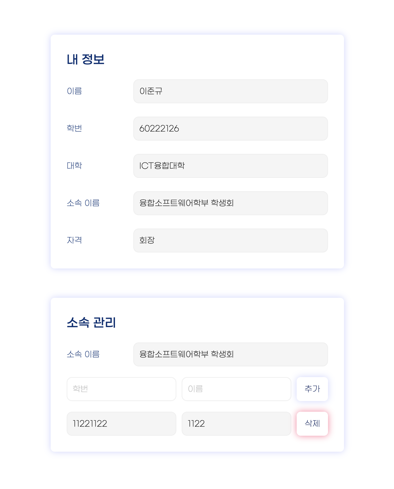

# 💡 투명지 (To MyongJi)

  
  
  
  

## 📌 프로젝트 소개

투명지(To MyongJi)는 "To MyongJi(명지대학교 학생들을 위해)"라는 의미와 동시에 학생회비 내역을 투명하게 공개한다는 목적을 담은 학생회비 통합 관리 플랫폼입니다.

최근 발생한 명지대학교 학생회비 횡령 사건을 계기로, 기존 학생회비 관리 방식의 불투명성과 비효율성을 해결하고자 개발되었습니다.

## 👥 팀원 소개

### Product Manager / Ops

|  |
| :------------------------------------------------------------------------------------------------------: |
|                                                **이서현**                                                |

### iOS / Frontend

|  |
| :--------------------------------------------------------------------------------------------------: |
|                                              **이준규**                                              |

### Backend

|  |  |
| :------------------------------------------------------------------------------------------------------: | :------------------------------------------------------------------------------------------------------------: |
|                                                **이서현**                                                |                                                   **박진형**                                                   |

## ✨ 주요 기능

<!-- 스플래시 화면 이미지 -->

  
  
투명지 시작 화면

### 📊 영수증 조회

- **일반 조회**: 모든 사용자가 접근 가능한 기본 조회 기능 (잔액 미표시)
- **학생회 소속원 조회**: 학생회 소속원만 접근 가능한 상세 조회 기능 (잔액 표시)

<!-- 영수증 조회 관련 이미지 -->

  
  
  
학과 선택 및 영수증 조회 화면

### ✍️ 영수증 작성 (로그인 필요)

- 날짜, 내용, 입금, 출금 내역을 저장
- 로그인한 사용자만 접근 가능

<!-- 영수증 작성 화면 이미지 -->

  
  
영수증 작성 화면

### 👤 프로필 관리 (로그인 필요)

- **내 정보 조회**: 학생회 소속원 및 회장 정보 확인
- **학생회 소속원 관리**
  - 소속원 조회
  - 소속원 추가/삭제 (학생회 회장 전용)

<!-- 프로필 화면 이미지 -->

  
  
마이페이지 화면

## 🛠 기술 스택

### 🍎 App(iOS)

 

### 🖥️ Web

### 🔧 Backend

### ⚙️ Ops

### 🛠 Collaboration

